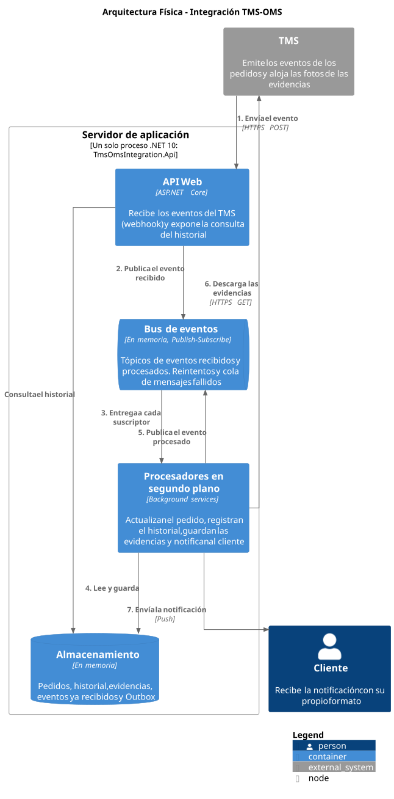

# Integración TMS-OMS

Integración que sincroniza el estado de los pedidos entre un **TMS** externo (por ejemplo,
Beetrack) y el **OMS** interno de una empresa de logística, y mantiene informados a los clientes
sobre el progreso de sus pedidos.

Recibe los eventos del TMS por webhook, actualiza el pedido en el OMS y, de forma asíncrona e
independiente, registra el historial, almacena las evidencias y notifica al cliente con su
propio formato, con reintentos automáticos ante fallos temporales.



## Documentación

| Documento | Contenido |
|---|---|
| [Arquitectura](docs/diagram.md) | Diagramas de arquitectura y descripción de componentes |
| [Decisiones técnicas](docs/technical-decisions.md) | Justificación de patrones, interpretaciones del enunciado, supuestos y limitaciones |

## Requisitos cubiertos

| # | Requisito | Implementación |
|---|---|---|
| 1 | Recepción de eventos vía webhook | `POST /api/webhooks/tms/events`: API key, validación de la trama, descarte de duplicados y respuesta `202 Accepted` |
| 2 | Actualización del estado del pedido | `Order.Apply` rechaza los eventos de pedidos en `DELIVERED` o `RETURNED` |
| 3 | Contador de visitas | `DELIVERED` y `NOT DELIVERED` suman una visita |
| 4 | Devolución | Al tercer `NOT DELIVERED` se emite `TO BE RETURN` automáticamente |
| 5 | Registro histórico | Historial de solo agregado, con los eventos aplicados y rechazados. `GET /api/orders/{orderNumber}/history` |
| 6 | Almacenamiento de evidencias | En los seis hitos se descargan las evidencias y se guardan por pedido |
| 7 | Notificación al cliente | Un formateador por cliente (Strategy) y uno por defecto |
| 8 | Lógica de reintentos | Backoff exponencial con jitter, cola de mensajes fallidos y Outbox |

## Tecnologías

- **.NET 10** y **ASP.NET Core Web API** con controllers
- **Clean Architecture**: proyectos `Domain`, `Application`, `Infrastructure` y `Api`
- **`System.Threading.Channels`** como bus Publish-Subscribe en memoria
- **Polly 8** (`Microsoft.Extensions.Http.Resilience`) para los reintentos
- Repositorios y almacenamiento **en memoria**, según lo permite el enunciado: no se requiere ningún servicio externo

## Estructura del proyecto

```
TmsOmsIntegration.slnx
├── TmsOmsIntegration.Domain          Reglas de negocio: aggregate Order y domain events
├── TmsOmsIntegration.Application     Casos de uso, suscriptores y puertos (interfaces)
├── TmsOmsIntegration.Infrastructure  Bus, Outbox, reintentos, repositorios, evidencias y notificaciones
├── TmsOmsIntegration.Api             Controllers, contratos de entrada y composición de la aplicación
└── docs                              Diagramas y decisiones técnicas
```

## Cómo ejecutarlo

### Requisitos previos

- [SDK de .NET 10](https://dotnet.microsoft.com/download)

### 1. Configurar la API key del webhook

El webhook exige una API key en el header `X-Api-Key`. Ningún secreto se guarda en el repositorio:
[`appsettings.model.json`](TmsOmsIntegration.Api/appsettings.model.json) muestra la estructura
esperada, y el valor se configura con User Secrets.

```bash
dotnet user-secrets set "TmsWebhook:ApiKey" "<tu-api-key>" --project TmsOmsIntegration.Api
```

Si la API key no está configurada, la aplicación no arranca e indica el motivo.

### 2. Ejecutar la API

```bash
dotnet run --project TmsOmsIntegration.Api --launch-profile http
```

La API queda disponible en `http://localhost:5020`.

### 3. Enviar un evento

El archivo [`TmsOmsIntegration.Api.http`](TmsOmsIntegration.Api/TmsOmsIntegration.Api.http)
contiene la trama de ejemplo del enunciado. Se puede ejecutar desde Visual Studio o VS Code
reemplazando `<your-tms-webhook-api-key>` por la API key configurada.

También con `curl`:

```bash
curl -X POST http://localhost:5020/api/webhooks/tms/events \
  -H "Content-Type: application/json" \
  -H "X-Api-Key: <tu-api-key>" \
  -d '{
    "serviceType": "LAST_MILE",
    "status": "NOT DELIVERED",
    "subStatus": "CLIENT ABSENT",
    "details": { "orderNumber": "2500000007-01" },
    "eventDate": "2025-04-15 10:00:00"
  }'
```

Y consultar el historial del pedido:

```bash
curl http://localhost:5020/api/orders/2500000007-01/history
```

El resultado de cada paso (notificaciones, evidencias guardadas, reintentos y mensajes fallidos)
se muestra en la consola de la aplicación.

## Endpoints

| Método | Ruta | Respuestas |
|---|---|---|
| `POST` | `/api/webhooks/tms/events` | `202` evento aceptado (también para duplicados) · `400` trama inválida · `401` API key ausente o incorrecta |
| `GET` | `/api/orders/{orderNumber}/history` | `200` historial del pedido · `404` el pedido no existe en el OMS |

## Datos de prueba

El OMS se representa con estos pedidos, que se cargan al iniciar la aplicación:

| Pedido | Cliente | Formato de notificación |
|---|---|---|
| `2500000006-01` | `01021755` (TIENDAS PERUANAS) | Propio del cliente |
| `2500000007-01` | `01021755` (TIENDAS PERUANAS) | Propio del cliente |
| `2500000008-01` | `01021800` | Por defecto |
| `2500000009-01` | `01021900` | Por defecto |

Todos los datos están en memoria: al reiniciar la aplicación, los pedidos vuelven a su estado inicial.

## Escenarios de prueba

| Escenario | Cómo probarlo | Resultado esperado |
|---|---|---|
| Devolución automática | Tres `NOT DELIVERED` sobre `2500000007-01`, con `eventDate` distintas | El historial muestra tres visitas y un `TO BE RETURN` automático |
| Pedido en estado final | Un `DELIVERED` y después un `PLANNING` sobre `2500000006-01` | El `PLANNING` queda en el historial como rechazado (`FinalState`) |
| Evento duplicado | El mismo evento dos veces | Ambos responden `202`; el segundo se descarta |
| Formato por cliente | Un evento sobre `2500000007-01` y otro sobre `2500000008-01` | Dos notificaciones con estructuras distintas en la consola |
| Evidencias | Un `DELIVERED` con una URL de evidencia válida y otra `htps://` | La válida se guarda; la inválida se omite sin rechazar el evento |
| Reintentos | Un `DELIVERED` con la evidencia `https://httpbin.org/status/503` | Reintentos con esperas crecientes y, al final, el mensaje en la cola de mensajes fallidos |

Cada evento nuevo necesita una `eventDate` distinta: si no, se descarta como duplicado.
