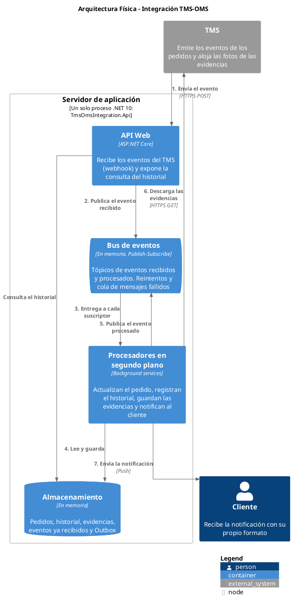
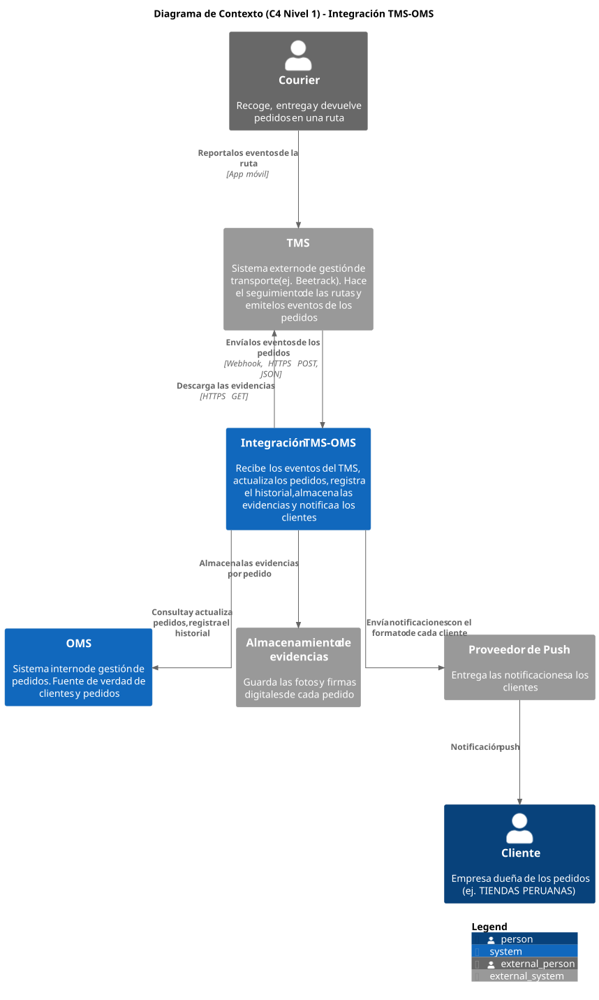
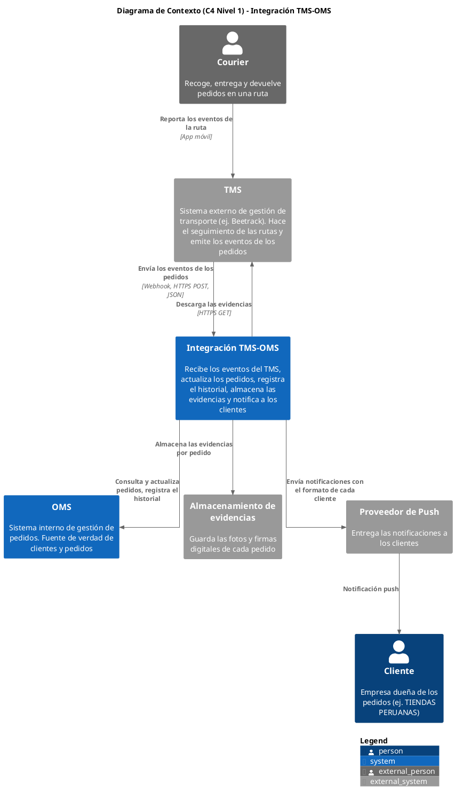
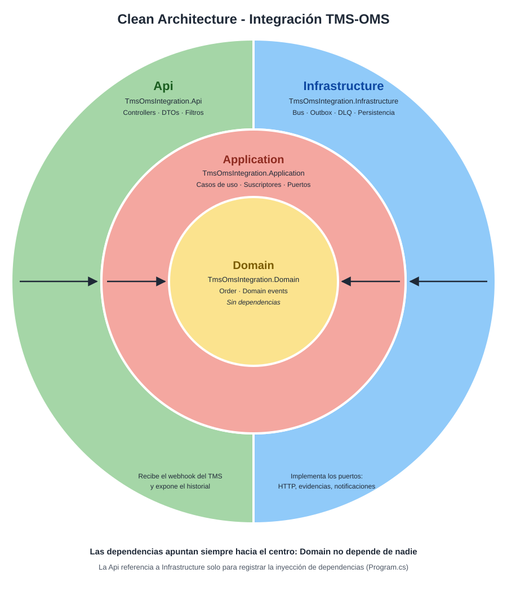
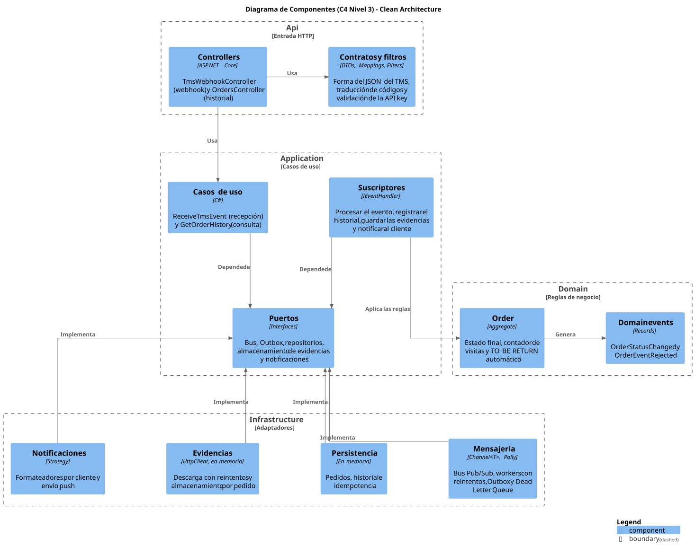
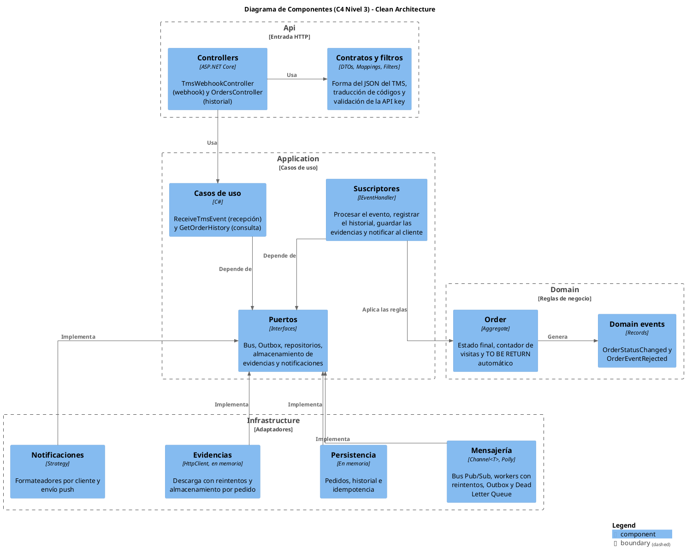

# Arquitectura - Integración TMS-OMS

La integración sincroniza el estado de los pedidos entre el **TMS** externo y el **OMS** interno.
Recibe los eventos del TMS por webhook, actualiza el pedido en el OMS y, de forma asíncrona e
independiente, registra el historial, almacena las evidencias y notifica al cliente.

Este documento cubre dos entregables del caso:

1. [Diagrama de Arquitectura](#1-diagrama-de-arquitectura)
2. [Descripción de Componentes](#2-descripción-de-componentes)

---

## 1. Diagrama de Arquitectura

La arquitectura se presenta en cuatro vistas, de la más concreta a la más interna:

| Vista | Responde |
|---|---|
| [1.1 Arquitectura física](#11-arquitectura-física) | ¿Dónde corre el sistema y cómo fluye un evento? |
| [1.2 Contexto](#12-contexto-c4-nivel-1) | ¿Con qué sistemas y personas se comunica? |
| [1.3 Clean Architecture](#13-clean-architecture) | ¿Cómo está organizado el código? |
| [1.4 Componentes](#14-componentes-c4-nivel-3) | ¿Qué piezas hay en cada capa y cómo dependen entre sí? |

### 1.1 Arquitectura física

Muestra los **artefactos** del sistema tal como se ejecuta hoy y los **flujos de comunicación**
entre ellos, numerados en el orden en que ocurren.

| Paso | Flujo | Descripción |
|---|---|---|
| 1 | TMS → API Web | El TMS envía el evento por webhook. La API valida la API key y la trama, descarta duplicados y responde `202 Accepted` |
| 2 | API Web → Bus de eventos | El evento se publica en el tópico de eventos recibidos |
| 3 | Bus → Procesadores | El bus entrega una copia del evento a cada suscriptor |
| 4 | Procesadores → Almacenamiento | Se aplica el evento al pedido (estado, visitas, devolución) y se guarda el resultado junto con el Outbox |
| 5 | Procesadores → Bus de eventos | El Outbox publica el evento procesado en el segundo tópico |
| 6 | Procesadores → TMS | En los hitos con evidencias, se descargan las fotos y firmas desde el TMS |
| 7 | Procesadores → Cliente | Se envía la notificación con el formato propio de cada cliente |

A partir del paso 5, los tres efectos secundarios (historial, evidencias y notificación) corren
**en paralelo**, cada uno con sus propios reintentos: el fallo de uno no detiene a los demás.

Código PlantUML

### 1.2 Contexto (C4 Nivel 1)

Muestra la integración como una sola caja y los sistemas y personas con los que se comunica.
En azul, lo que pertenece a la empresa; en gris, lo externo.

Código PlantUML

### 1.3 Clean Architecture

El código se organiza en cuatro proyectos. Las dependencias apuntan siempre hacia el centro:
el dominio contiene las reglas de negocio y no depende de nada.

| Capa | Proyecto | Depende de |
|---|---|---|
| Domain | `TmsOmsIntegration.Domain` | Nada |
| Application | `TmsOmsIntegration.Application` | Domain |
| Infrastructure | `TmsOmsIntegration.Infrastructure` | Application |
| Api | `TmsOmsIntegration.Api` | Application e Infrastructure (solo para registrar la inyección de dependencias en `Program.cs`) |

### 1.4 Componentes (C4 Nivel 3)

Muestra las piezas de cada capa y sus dependencias. Application define los **puertos**
(interfaces) e Infrastructure los **implementa**: así, cambiar una tecnología (por ejemplo, el
bus en memoria por un broker de mensajería) no afecta a Application ni a Domain.

Código PlantUML

---

## 2. Descripción de Componentes

### 2.1 Sistemas y personas externos

| Componente | Función |
|---|---|
| **Courier** | Persona que recoge, entrega y devuelve los pedidos. Reporta cada evento de la ruta en el TMS |
| **TMS** | Sistema externo de gestión de transporte (por ejemplo, Beetrack). Emite los eventos de los pedidos por webhook y aloja las fotos y firmas de las evidencias |
| **OMS** | Sistema interno de gestión de pedidos. Es la fuente de verdad de clientes y pedidos |
| **Almacenamiento de evidencias** | Guarda las evidencias digitales de cada pedido, organizadas por número de pedido |
| **Proveedor de Push** | Entrega las notificaciones a cada cliente |
| **Cliente** | Empresa dueña de los pedidos. Recibe las notificaciones con su propia estructura |

### 2.2 Artefactos de la arquitectura física

| Componente | Función |
|---|---|
| **Servidor de aplicación** | Un solo proceso .NET 10 (`TmsOmsIntegration.Api`) que contiene la API, el bus, los procesadores y el almacenamiento |
| **API Web** | Punto de entrada HTTP. Recibe el webhook del TMS, responde rápido con `202 Accepted` y expone la consulta del historial |
| **Bus de eventos** | Mensajería Publish-Subscribe en memoria con dos tópicos: eventos recibidos y eventos procesados. Cada suscriptor tiene su propio canal, con reintentos y cola de mensajes fallidos |
| **Procesadores en segundo plano** | Consumen los tópicos: actualizan el pedido, registran el historial, guardan las evidencias y notifican al cliente. También publican el Outbox |
| **Almacenamiento** | Pedidos, historial, evidencias, claves de los eventos ya recibidos y mensajes pendientes del Outbox |

### 2.3 Componentes por capa

#### Api

| Componente | Función |
|---|---|
| **TmsWebhookController** | Endpoint `POST /api/webhooks/tms/events`. Delega en el caso de uso de recepción y responde `202` también para los duplicados, para que el TMS deje de reenviarlos |
| **OrdersController** | Endpoint `GET /api/orders/{orderNumber}/history`. Devuelve el historial del pedido, o `404` si el pedido no existe en el OMS |
| **Contratos y filtros** | `TmsEventRequest` replica la trama del TMS y la valida. `TmsCodes` traduce los valores del TMS (por ejemplo, `"AT PICKUP POINT"`) a los enums del dominio. `TmsEventDateConverter` interpreta el formato de fecha del TMS. `ApiKeyAuthFilter` valida el header `X-Api-Key` con una comparación de tiempo constante |

#### Application

| Componente | Función |
|---|---|
| **ReceiveTmsEvent** | Calcula una clave por evento (el TMS no envía un identificador), descarta los duplicados y publica el evento recibido. Si la publicación falla, libera la clave para que el reenvío del TMS no se pierda |
| **ProcessTmsEventHandler** | Suscriptor del tópico de eventos recibidos. Busca el pedido, le aplica el evento y deja el resultado en el Outbox antes de guardar el pedido |
| **RecordHistoryHandler** | Registra en el historial cada evento procesado, tanto los aplicados como los rechazados |
| **StoreEvidencesHandler** | Solo en los seis hitos con evidencias (`COLLECTED`, `NOT COLLECTED`, `DELIVERED`, `NOT DELIVERED`, `RETURNED`, `NOT RETURNED`): descarga cada evidencia y la guarda asociada al pedido. Una URL inválida se omite sin frenar el evento |
| **NotifyClientHandler** | Obtiene el cliente desde el OMS, elige su formateador y envía una notificación por cada cambio de estado. Los eventos rechazados no se notifican |
| **GetOrderHistory** | Caso de uso de consulta del historial |
| **Puertos** | Interfaces que Application necesita y que Infrastructure implementa: bus de eventos, Outbox, cola de mensajes fallidos, repositorios, descarga y almacenamiento de evidencias, formateo y envío de notificaciones |

#### Domain

| Componente | Función |
|---|---|
| **Order** | Aggregate del pedido. Es el único lugar donde cambia su estado: rechaza los eventos si el pedido ya está en `DELIVERED` o `RETURNED`, suma una visita con cada `DELIVERED` o `NOT DELIVERED`, y emite `TO BE RETURN` automáticamente cuando la tercera visita es un `NOT DELIVERED` |
| **Domain events** | `OrderStatusChanged` (el pedido cambió de estado, con una marca si el cambio fue automático) y `OrderEventRejected` (el evento se rechazó, con su motivo) |

#### Infrastructure

| Componente | Función |
|---|---|
| **Mensajería** | `ChannelEventBus` reparte cada mensaje en el canal de cada suscriptor (fan-out). `SubscriberWorker` consume cada canal con tres reintentos con backoff exponencial, y envía a la cola de mensajes fallidos lo que agota los reintentos. `OutboxDispatcher` publica los mensajes pendientes y solo los quita del Outbox después de publicarlos |
| **Persistencia** | Repositorios en memoria de pedidos (con datos de prueba que representan al OMS) y de historial (solo agrega, nunca modifica). Almacén de claves para descartar eventos duplicados |
| **Evidencias** | `HttpEvidenceDownloader` descarga cada evidencia por streaming, con reintentos con backoff exponencial y jitter, y timeouts por intento y totales. `InMemoryEvidenceStorage` las guarda en la ruta `orders/{pedido}/{archivo}` |
| **Notificaciones** | Un formateador por defecto y uno específico para el cliente `01021755`, cada uno con su propia estructura de mensaje. `FakePushNotificationSender` simula el envío push escribiendo la notificación en el log |

### 2.4 Implementación actual y evolución

Según lo permitido por el caso, los servicios externos se reemplazan por implementaciones en
memoria. Gracias a los puertos, cada una se puede sustituir por un servicio real sin modificar
Application ni Domain.

| Componente | Implementación actual | Evolución a producción |
|---|---|---|
| Bus de eventos | `Channel<T>` en memoria | Broker de mensajería durable con tópicos, suscripciones y cola de mensajes fallidos nativa |
| Pedidos, historial y Outbox | Diccionarios en memoria | Base de datos del OMS, con el pedido y el Outbox en la misma transacción |
| Claves de idempotencia | Diccionario en memoria, sin expiración | Caché distribuida con expiración |
| Almacenamiento de evidencias | Diccionario en memoria | Almacenamiento de objetos con acceso privado |
| Envío push | Escritura en el log | Proveedor de notificaciones push o webhook de cada cliente |
| API key del webhook | User Secrets | Gestor de secretos |
